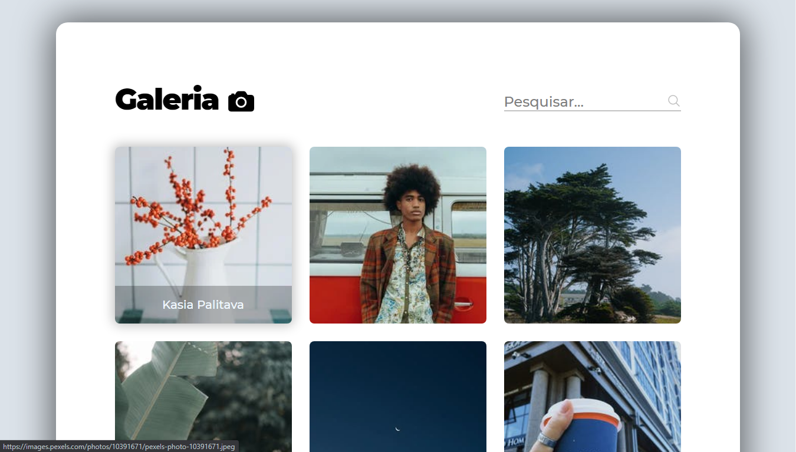

<h1 align="center">ALBUM DE FOTOS.</h1>

    <a href="#sobre">Sobre</a> |
    <a href="#tecnologias">Tecnologias</a> 

 

<h2 id="sobre">Sobre<h2>

Este projeto, como o próprio nome diz é um Album de fotos. Todas as fotos vem da API PEXELS.

 

<h2 id="tecnologias">Tecnologias<h2>

Este projeto foi desenvolvido ultilizando: HTML5, CSS, JavaScript consumido uma API da PEXELS

 

<h4 align="center">
    Projeto Finalizado....
</h4>